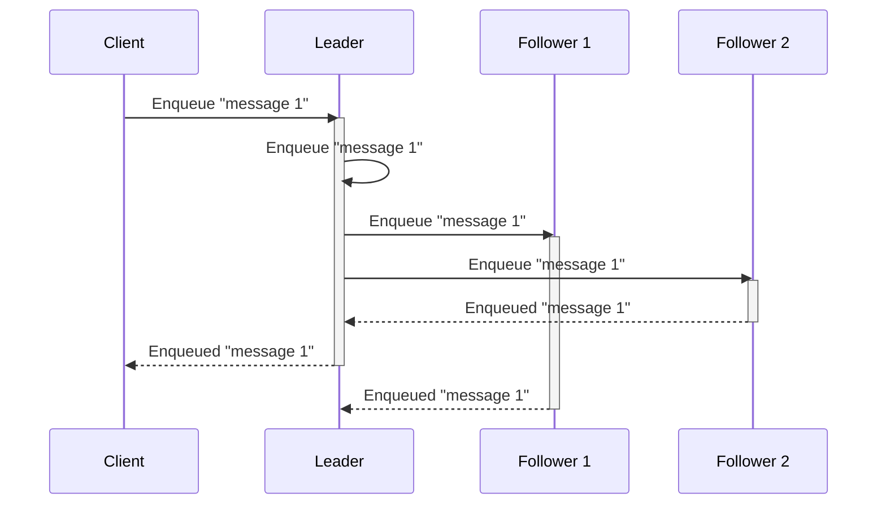
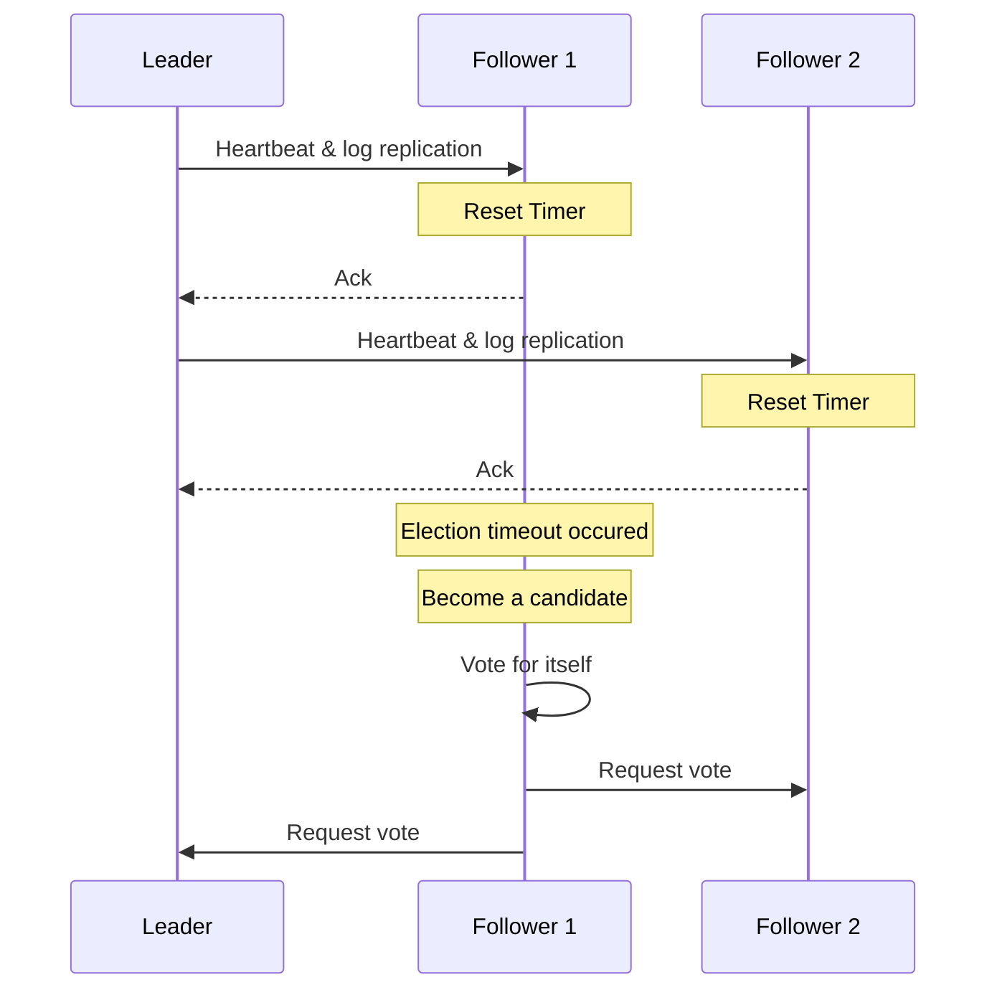

# doq [](https://drone.coroutine.dev/kgantsov/doq) [](https://codecov.io/gh/kgantsov/doq)

`doq` is a distributed ordered (by priority) queue based on the Raft consensus algorithm.

The Raft consensus algorithm is a protocol for managing a replicated log across a distributed system to ensure consistency and reliability. Raft is designed to be understandable and practical, offering a robust solution to the consensus problem, which is fundamental for building fault-tolerant distributed systems.

This means that the majority of nodes needs to agre on a value before acknowledging it and returning to a client, which is demostrated in the following diagram:




## Running doq

```bash
git clone git@github.com:kgantsov/doq.git
cd doq/cmd/server
go build -o doq
```

Run the first node

```bash
./doq --storage.data_dir data --cluster.node_id node-1 --http.port 8001 --raft.address localhost:9001 --grpc.address localhost:10001
```

Run other nodes

```bash
./doq --storage.data_dir data --cluster.node_id node-2 --http.port 8002 --raft.address localhost:9002 --grpc.address localhost:10002 --cluster.join_addr localhost:8001
./doq --storage.data_dir data --cluster.node_id node-3 --http.port 8003 --raft.address localhost:9003 --grpc.address localhost:10003 --cluster.join_addr localhost:8001
```

You can find swagger docs by opening http://localhost:8001/docs


## Deploying doq to a kubernetes ckuster

Deployments is implemented though the infrastructure as a code tool called [pulumi](https://www.pulumi.com/) and the deployment code is located under a `deploy` folder.

To deploy doq to your kubernetes cluster you need to run `pulumi up` inside the `deploy` folder and follow the interactive instructions provided by pulumi.

```bash
cd deploy
pulumi up
```
It will take a few minutes for pulumi to create all the necessary kubernetes resources.

A statefulset with 3 pods by default will be created as well as two different services. The first service `doq-internal` is a headless and allows nodes to find eachother and form a cluster automatically. As the name suggests `doq-internal` service should not be used by `doq` clients, instead the second `doq` service clients should connect to. The biggest difference between the two is that `doq-internal` service will contain all the pods regardless if they are in the leader or in the follower state. On the other hand `doq` will only point to a leader pod. In case the leader dies the election process will kick in by one of the followers and when the follower is promoted to a leader the `doq` service will be updated and will point to this new leader pod.


## Creating and removing queues

There are two types of queues: delayed and fair. The default queue type is delayed. All messages enqueued in delayed queues are delivered based on their priority. The lower the number, the higher the priority. If a message needs to be delivered at a future time, you can set the priority property to a Unix timestamp, and the message won't be delivered until that time.

The fair queue delivers messages fairly based on the group field. For example, imagine you have a queue called transcode where you schedule the transcoding of videos uploaded by your customers. Ideally, the transcoding tasks for one customer shouldn’t block those for other customers, especially if one customer uploads thousands of videos and you only have a limited number of transcode workers. In this case, you would assign the customer’s name or ID to the group field when enqueuing messages. This ensures that when messages are dequeued, they are processed in a round-robin fashion by customer.

To create a delayed queue named `user_indexing_queue` run:

```bash
curl --request POST \
  --url http://localhost:8001/API/v1/queues \
  --header 'Accept: application/json, application/problem+json' \
  --header 'Content-Type: application/json' \
  --data '{"name": "user_indexing_queue", "type": "delayed"}'
```

To delete a queue that we created in a previous step run

```bash
curl --request DELETE \
  --url http://localhost:8001/API/v1/queues/user_indexing_queue \
  --header 'Accept: application/json, application/problem+json'
```


## Enqueuing and dequeuing message

To enqueue a message to a queue named `user_indexing_queue` run:

```bash
curl --request POST \
  --url http://localhost:8001/API/v1/queues/user_indexing_queue/messages \
  --header 'Accept: application/json, application/problem+json' \
  --header 'Content-Type: application/json' \
  --data '{"content": "{\"user_id\": 1}", "group": "default", "priority": 60}'
```

To dequeue a message from a queue and acknowledge it automatically run

```bash
curl --request GET \
  --url 'http://localhost:8001/API/v1/queues/user_indexing_queue/messages?ack=true' \
  --header 'Accept: application/json, application/problem+json'
```

In case a message was not acked on dequeuing a manual acknowledgmenet needs to be done by calling ack endpoint specifying the ID of a message

```python
curl --request POST \
  --url http://localhost:8001/API/v1/queues/user_indexing_queue/messages/123/ack \
  --header 'Accept: application/json, application/problem+json' \
  --header 'Content-Type: application/json'
```

If a message was not acked after a some timeout it will go back to a queue.

To change a priority of the message with ID `123` to `12` call:
```python
curl --request PUT \
  --url http://localhost:8001/API/v1/queues/user_indexing_queue/messages/123/priority \
  --header 'Accept: application/json, application/problem+json' \
  --header 'Content-Type: application/json' \
  --data '{"priority": 12}'
```

## GRPC interface

Producing messages
```go
package main

import (
	"context"
	"fmt"
	"os"
	"time"

	pb "github.com/kgantsov/doq/pkg/proto"
	"github.com/rs/zerolog"
	"github.com/rs/zerolog/log"
	"google.golang.org/grpc"
)

func main() {
	log.Logger = log.Output(zerolog.ConsoleWriter{Out: os.Stderr, TimeFormat: time.RFC3339Nano})
	zerolog.TimeFieldFormat = zerolog.TimeFormatUnixNano
	// Connect to the gRPC server (leader node)
	conn, err := grpc.Dial("localhost:10001", grpc.WithInsecure())
	if err != nil {
		log.Fatal().Msgf("Failed to connect: %v", err)
	}
	defer conn.Close()

	client := pb.NewDOQClient(conn)

	client.CreateQueue(context.Background(), &pb.CreateQueueRequest{
		Name: "test-queue",
		Type: "delayed",
	})

	// Create a stream for sending messages
	stream, err := client.EnqueueStream(context.Background())
	if err != nil {
		log.Fatal().Msgf("Failed to open stream: %v", err)
	}

	// Produce messages in a loop
	for i := 0; i < 1000000; {
		msg := &pb.EnqueueRequest{
			QueueName: "test-queue",
			Content:   fmt.Sprintf("Message content %d", i),
			Group:     "default",
			Priority:  10,
		}

		// Send the message to the queue
		if err := stream.Send(msg); err != nil {
			log.Fatal().Msgf("Failed to send message: %v", err)
		}

		// Receive the acknowledgment from the server
		ack, err := stream.Recv()
		if err != nil {
			log.Fatal().Msgf("Failed to receive acknowledgment: %v", err)
		}
		log.Info().Msgf("Sent a message %d %s Success=%v", ack.Id, ack.Content, ack.Success)

		i++
		// time.Sleep(200 * time.Millisecond) // Simulate delay between messages
	}

	// Close the stream
	if err := stream.CloseSend(); err != nil {
		log.Fatal().Msgf("Failed to close stream: %v", err)
	}
}
```

Consuming messages
```go
package main

import (
	"context"
	"os"
	"time"

	pb "github.com/kgantsov/doq/pkg/proto"
	"github.com/rs/zerolog"
	"github.com/rs/zerolog/log"
	"google.golang.org/grpc"
)

func main() {
	log.Logger = log.Output(zerolog.ConsoleWriter{Out: os.Stderr, TimeFormat: time.RFC3339Nano})
	zerolog.TimeFieldFormat = zerolog.TimeFormatUnixNano
	// Connect to the gRPC server (leader node)
	conn, err := grpc.Dial("localhost:10001", grpc.WithInsecure())
	if err != nil {
		log.Fatal().Msgf("Failed to connect: %v", err)
	}
	defer conn.Close()

	client := pb.NewDOQClient(conn)

	// Open a stream to receive messages from the queue
	stream, err := client.DequeueStream(context.Background(), &pb.DequeueRequest{
		QueueName: "test-queue",
		Ack:       false,
	})
	if err != nil {
		log.Fatal().Msgf("Failed to open stream: %v", err)
	}

	// Consume messages from the stream
	for {
		msg, err := stream.Recv()
		if err != nil {
			log.Fatal().Msgf("Failed to receive message: %v", err)
		}

		// Process the message
		log.Info().Msgf("Received message: ID=%d, Content=%s", msg.Id, msg.Content)

    // time.Sleep(500 * time.Millisecond) // Simulate message processing time

		client.Acknowledge(context.Background(), &pb.AcknowledgeRequest{
			QueueName: "test-queue",
			Id:        msg.Id,
		})
	}
}

```


## Consistency
Achieving consistency in a distributed queue involves ensuring that only one process or node can enqueue a message at any given time, preventing race conditions and ensuring that operations on shared resources are conducted in a safe and coordinated manner. This means that all enqueue and dequeue requests must go through the cluster leader. The leader communicates with other nodes and acknowledges the request once a majority has agreed.

## Tolerating failures
To run a fully fault-tolerant system using the Raft consensus algorithm, you need to configure an odd number of nodes, with a minimum of three nodes. This odd-numbered configuration ensures that the system can tolerate a certain number of node failures while still maintaining the ability to reach a consensus and operate correctly.

Node Requirements for Fault Tolerance:

1. Three Nodes: This is the minimum recommended setup for fault tolerance. In a three-node cluster, the system can tolerate the failure of one node. This configuration allows the system to continue operating as long as a majority of nodes (in this case, two out of three) are up and able to communicate.

2. Five Nodes: This setup improves fault tolerance by allowing the system to tolerate up to two node failures. In a five-node cluster, the system can continue to operate as long as a majority of nodes (three out of five) are operational.

3. Seven Nodes: For higher levels of fault tolerance, you can use seven nodes, which allows the system to tolerate up to three node failures. The system remains operational as long as four out of seven nodes are functioning.

Practical Considerations:

- Latency and Performance: Adding more nodes increases fault tolerance but can also increase latency and decrease performance due to the need for more communication between nodes.
- Resource Management: More nodes require more resources (e.g., CPU, memory, network bandwidth), so it's essential to balance fault tolerance with resource availability and costs.
- Network Partitions: Ensure network reliability to minimize the chances of network partitions, which can prevent nodes from communicating and reaching a consensus.

Node failure detection:

The leader periodically sends heartbeat messages to all follower nodes to assert its leadership. So when the leader dies for some reason after some period (election timeout) other nodes will conclude that leader has failed and will start a new leader election.


