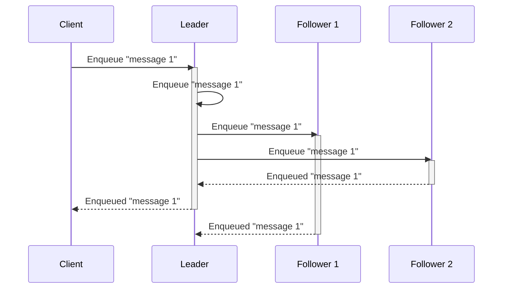
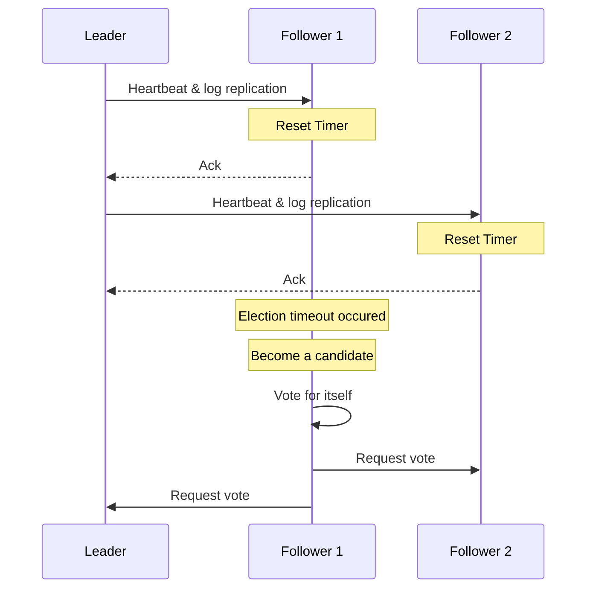

# DOQ [](https://drone.coroutine.dev/kgantsov/doq) [](https://goreportcard.com/report/github.com/kgantsov/doq) [](https://codecov.io/gh/kgantsov/doq)

`DOQ` is a distributed ordered (by priority) queue based on the Raft consensus algorithm by
[hashicorp/raft](https://github.com/hashicorp/raft) and [BadgerDB](https://dgraph.io/blog/post/badger/).

The Raft consensus algorithm is a protocol for managing a replicated log across a distributed system to ensure consistency and reliability. Raft is designed to be understandable and practical, offering a robust solution to the consensus problem, which is fundamental for building fault-tolerant distributed systems.

This means that the majority of nodes needs to agre on a value before acknowledging it and returning to a client, which is demostrated in the following diagram:




## Running doq

```bash
git clone git@github.com:kgantsov/doq.git
cd doq
make build_web
cd /cmd/server
go build -o doq
```

Run the first node

```bash
./doq --storage.data_dir data --cluster.node_id node-0 --http.port 8000 --raft.address localhost:9000 --grpc.address localhost:10000
```

Run other nodes

```bash
./doq --storage.data_dir data --cluster.node_id node-1 --http.port 8001 --raft.address localhost:9001 --grpc.address localhost:10001 --cluster.join_addr localhost:8000
./doq --storage.data_dir data --cluster.node_id node-2 --http.port 8002 --raft.address localhost:9002 --grpc.address localhost:10002 --cluster.join_addr localhost:8000
```

You can find swagger docs by opening http://localhost:8000/docs


## Deploying doq to a Kubernetes cluster

Deployment is managed using [Kustomize](https://kustomize.io/), a tool integrated into `kubectl` that simplifies the customization of Kubernetes configurations. The deployment manifests are located in the `overlays` directory within the `deploy` folder.

To deploy `doq` to your Kubernetes cluster, navigate to the appropriate overlay directory (e.g., `overlays/dev`) and apply the configuration using `kubectl`:

```bash
kubectl apply -k overlays/dev
```

This will create all the necessary Kubernetes resources, including a StatefulSet with 3 pods by default and two services:

1. **`doq-internal` Service**: A headless service that allows nodes to discover each other and form a cluster automatically. This service is for internal use and should not be accessed by `doq` clients.

2. **`doq` Service**: This service is intended for client connections. Unlike `doq-internal`, it only points to the leader pod. If the leader fails, a new leader is elected, and the `doq` service is updated to point to the new leader pod.

The deployment process will take a few minutes to complete, during which the cluster will initialize and become ready for use.


## Creating and removing queues

There are two types of queues: delayed and fair. The default queue type is delayed. All messages enqueued in delayed queues are delivered based on their priority. The lower the number, the higher the priority. If a message needs to be delivered at a future time, you can set the priority property to a Unix timestamp, and the message won't be delivered until that time.

The fair queue delivers messages fairly based on the group field. For example, imagine you have a queue called transcode where you schedule the transcoding of videos uploaded by your customers. Ideally, the transcoding tasks for one customer shouldn’t block those for other customers, especially if one customer uploads thousands of videos and you only have a limited number of transcode workers. In this case, you would assign the customer’s name or ID to the group field when enqueuing messages. This ensures that when messages are dequeued, they are processed in a round-robin fashion by customer.

To create a delayed queue named `user_indexing_queue` run:

```bash
curl --request POST \
  --url http://localhost:8000/API/v1/queues \
  --header 'Accept: application/json, application/problem+json' \
  --header 'Content-Type: application/json' \
  --data '{"name": "user_indexing_queue", "type": "delayed"}'
```

To delete a queue that we created in a previous step run

```bash
curl --request DELETE \
  --url http://localhost:8000/API/v1/queues/user_indexing_queue \
  --header 'Accept: application/json, application/problem+json'
```


## Enqueuing and dequeuing message

To enqueue a message to a queue named `user_indexing_queue` run:

```bash
curl --request POST \
  --url http://localhost:8000/API/v1/queues/user_indexing_queue/messages \
  --header 'Accept: application/json, application/problem+json' \
  --header 'Content-Type: application/json' \
  --data '{"content": "{\"user_id\": 1}", "group": "default", "priority": 60}'
```

To dequeue a message from a queue and acknowledge it automatically run

```bash
curl --request GET \
  --url 'http://localhost:8000/API/v1/queues/user_indexing_queue/messages?ack=true' \
  --header 'Accept: application/json, application/problem+json'
```

In case a message was not acked on dequeuing a manual acknowledgmenet needs to be done by calling ack endpoint specifying the ID of a message

```python
curl --request POST \
  --url http://localhost:8000/API/v1/queues/user_indexing_queue/messages/123/ack \
  --header 'Accept: application/json, application/problem+json' \
  --header 'Content-Type: application/json'
```

If a message was not acked after a some timeout it will go back to a queue.

To change a priority of the message with ID `123` to `12` call:
```python
curl --request PUT \
  --url http://localhost:8000/API/v1/queues/user_indexing_queue/messages/123/priority \
  --header 'Accept: application/json, application/problem+json' \
  --header 'Content-Type: application/json' \
  --data '{"priority": 12}'
```

## GRPC interface

Producing messages
```go
package main

import (
	"context"
	"fmt"
	"os"
	"time"

	pb "github.com/kgantsov/doq/pkg/proto"
	"github.com/rs/zerolog"
	"github.com/rs/zerolog/log"
	"google.golang.org/grpc"
)

func main() {
	log.Logger = log.Output(zerolog.ConsoleWriter{Out: os.Stderr, TimeFormat: time.RFC3339Nano})
	zerolog.TimeFieldFormat = zerolog.TimeFormatUnixNano
	// Connect to the gRPC server (leader node)
	conn, err := grpc.Dial("localhost:10000", grpc.WithInsecure())
	if err != nil {
		log.Fatal().Msgf("Failed to connect: %v", err)
	}
	defer conn.Close()

	client := pb.NewDOQClient(conn)

	client.CreateQueue(context.Background(), &pb.CreateQueueRequest{
		Name: "test-queue",
		Type: "delayed",
	})

	// Create a stream for sending messages
	stream, err := client.EnqueueStream(context.Background())
	if err != nil {
		log.Fatal().Msgf("Failed to open stream: %v", err)
	}

	// Produce messages in a loop
	for i := 0; i < 1000000; {
		msg := &pb.EnqueueRequest{
			QueueName: "test-queue",
			Content:   fmt.Sprintf("Message content %d", i),
			Group:     "default",
			Priority:  10,
		}

		// Send the message to the queue
		if err := stream.Send(msg); err != nil {
			log.Fatal().Msgf("Failed to send message: %v", err)
		}

		// Receive the acknowledgment from the server
		ack, err := stream.Recv()
		if err != nil {
			log.Fatal().Msgf("Failed to receive acknowledgment: %v", err)
		}
		log.Info().Msgf("Sent a message %d %s Success=%v", ack.Id, ack.Content, ack.Success)

		i++
		// time.Sleep(200 * time.Millisecond) // Simulate delay between messages
	}

	// Close the stream
	if err := stream.CloseSend(); err != nil {
		log.Fatal().Msgf("Failed to close stream: %v", err)
	}
}
```

Consuming messages
```go
package main

import (
	"context"
	"os"
	"time"

	pb "github.com/kgantsov/doq/pkg/proto"
	"github.com/rs/zerolog"
	"github.com/rs/zerolog/log"
	"google.golang.org/grpc"
)

func main() {
	log.Logger = log.Output(zerolog.ConsoleWriter{Out: os.Stderr, TimeFormat: time.RFC3339Nano})
	zerolog.TimeFieldFormat = zerolog.TimeFormatUnixNano
	// Connect to the gRPC server (leader node)
	conn, err := grpc.Dial("localhost:10000", grpc.WithInsecure())
	if err != nil {
		log.Fatal().Msgf("Failed to connect: %v", err)
	}
	defer conn.Close()

	client := pb.NewDOQClient(conn)

	// Open a stream to receive messages from the queue
	stream, err := client.DequeueStream(context.Background(), &pb.DequeueRequest{
		QueueName: "test-queue",
		Ack:       false,
	})
	if err != nil {
		log.Fatal().Msgf("Failed to open stream: %v", err)
	}

	// Consume messages from the stream
	for {
		msg, err := stream.Recv()
		if err != nil {
			log.Fatal().Msgf("Failed to receive message: %v", err)
		}

		// Process the message
		log.Info().Msgf("Received message: ID=%d, Content=%s", msg.Id, msg.Content)

		client.Ack(context.Background(), &pb.AckRequest{
			QueueName: "test-queue",
			Id:        msg.Id,
		})
		// time.Sleep(500 * time.Millisecond) // Simulate message processing time
	}
}

```

## Backups and restores

DOQ provides support for both full and incremental backups of the database on the leader node 
via a simple HTTP API.

### Creating a Backup
To create a backup, send an HTTP POST request to the `/db/backup` endpoint.

- A full backup is performed when the since parameter is set to 0.
- An incremental backup captures only the entries added or modified since the last backup.
  To generate an incremental backup, set the since parameter to the last backup’s `X-Last-Version`
  header value, incremented by 1.

#### Example: Full Backup Using `curl`

```bash
curl -v --raw --request POST \
  --url http://localhost:8000/db/backup \
  --header 'Accept: application/problem+json' \
  --header 'Content-Type: application/json' \
  --data '{"since": 0}' -o backup-0.bak
```
The response includes an `X-Last-Version` header, indicating the last dumped entry’s version.
This value (incremented by 1) should be used in the since parameter for the next incremental backup.

### Restoring a (full) Backup

To restore a database on a standalone node (running on localhost), send an HTTP POST request to
the `/db/restore` endpoint with the backup file.

#### Example: Restore Using `curl`

```bash
curl --request POST \
  --url http://localhost:8000/db/restore \
  --header 'Accept: application/json, application/problem+json' \
  --header 'Content-Type: multipart/form-data' \
  --form 'file=@backup-0.bak'
```

### Restoring from Multiple Backups

If restoring from multiple backups, first restore from the full backup, followed by the
incremental backups in sequence.

#### Example: Restore Using `restore` sub-command

```bash
./doq restore -f backup-0.bak -i backup-1.bak -i backup-2.bak
```

This command restores the full backup (backup-0.bak) first, then applies the incremental
backups (backup-1.bak, backup-2.bak) in order.


## Consistency
Achieving consistency in a distributed queue involves ensuring that only one process or node can enqueue a message at any given time, preventing race conditions and ensuring that operations on shared resources are conducted in a safe and coordinated manner. This means that all enqueue and dequeue requests must go through the cluster leader. The leader communicates with other nodes and acknowledges the request once a majority has agreed.

## Tolerating failures
To run a fully fault-tolerant system using the Raft consensus algorithm, you need to configure an odd number of nodes, with a minimum of three nodes. This odd-numbered configuration ensures that the system can tolerate a certain number of node failures while still maintaining the ability to reach a consensus and operate correctly.

Node Requirements for Fault Tolerance:

1. Three Nodes: This is the minimum recommended setup for fault tolerance. In a three-node cluster, the system can tolerate the failure of one node. This configuration allows the system to continue operating as long as a majority of nodes (in this case, two out of three) are up and able to communicate.

2. Five Nodes: This setup improves fault tolerance by allowing the system to tolerate up to two node failures. In a five-node cluster, the system can continue to operate as long as a majority of nodes (three out of five) are operational.

3. Seven Nodes: For higher levels of fault tolerance, you can use seven nodes, which allows the system to tolerate up to three node failures. The system remains operational as long as four out of seven nodes are functioning.

Practical Considerations:

- Latency and Performance: Adding more nodes increases fault tolerance but can also increase latency and decrease performance due to the need for more communication between nodes.
- Resource Management: More nodes require more resources (e.g., CPU, memory, network bandwidth), so it's essential to balance fault tolerance with resource availability and costs.
- Network Partitions: Ensure network reliability to minimize the chances of network partitions, which can prevent nodes from communicating and reaching a consensus.

Node failure detection:

The leader periodically sends heartbeat messages to all follower nodes to assert its leadership. So when the leader dies for some reason after some period (election timeout) other nodes will conclude that leader has failed and will start a new leader election.



## Benchmarking

You can benchmark DOQ using the provided k6 load testing script located in the testing/load/ directory.


### Prerequisites:

- Install [k6](https://k6.io/open-source/) if you haven't already.

### Running the Benchmark

From the project root, run:

```bash
k6 run -u 100 -d 10s testing/load/queue.js
```

- -u 100 specifies 100 virtual users.

- -d 10s specifies a test duration of 10 seconds.

- queue.js contains the load script targeting the DOQ server.

Feel free to adjust the number of users (-u) and duration (-d) to simulate different loads.

### Notes

- Make sure your DOQ server is running and accessible before starting the benchmark.

- Monitor CPU, memory, and disk I/O usage on the server to understand system bottlenecks during load testing.


### Example Output
```bash
$ k6 run -u 100 -d 10s testing/load/queue.js

         /\      Grafana   /‾‾/  
    /\  /  \     |\  __   /  /   
   /  \/    \    | |/ /  /   ‾‾\ 
  /          \   |   (  |  (‾)  |
 / __________ \  |_|\_\  \_____/ 

     execution: local
        script: queue.js
        output: -

     scenarios: (100.00%) 1 scenario, 100 max VUs, 40s max duration (incl. graceful stop):
              * default: 100 looping VUs for 10s (gracefulStop: 30s)


     ✓ enqueued
     ✓ dequeued

     checks.........................: 100.00% 258996 out of 258996
     data_received..................: 197 MB  20 MB/s
     data_sent......................: 65 MB   6.5 MB/s
     http_req_blocked...............: avg=6.67µs   min=0s       med=1µs    max=31.09ms  p(90)=2µs     p(95)=3µs    
     http_req_connecting............: avg=671ns    min=0s       med=0s     max=2.89ms   p(90)=0s      p(95)=0s     
     http_req_duration..............: avg=3.56ms   min=62µs     med=3.18ms max=120.02ms p(90)=5.4ms   p(95)=7.76ms 
       { expected_response:true }...: avg=3.56ms   min=62µs     med=3.18ms max=120.02ms p(90)=5.4ms   p(95)=7.76ms 
     http_req_failed................: 0.00%   0 out of 258998
     http_req_receiving.............: avg=278.05µs min=5µs      med=9µs    max=98.98ms  p(90)=34µs    p(95)=110µs  
     http_req_sending...............: avg=70.44µs  min=1µs      med=3µs    max=53.18ms  p(90)=11µs    p(95)=45µs   
     http_req_tls_handshaking.......: avg=0s       min=0s       med=0s     max=0s       p(90)=0s      p(95)=0s     
     http_req_waiting...............: avg=3.21ms   min=49µs     med=3.14ms max=67.3ms   p(90)=5.04ms  p(95)=6.65ms 
     http_reqs......................: 258998  25830.306144/s
     iteration_duration.............: avg=7.7ms    min=215.87µs med=6.7ms  max=127.23ms p(90)=12.47ms p(95)=18.75ms
     iterations.....................: 129498  12915.05334/s
     vus............................: 100     min=100              max=100
     vus_max........................: 100     min=100              max=100


running (10.0s), 000/100 VUs, 129498 complete and 0 interrupted iterations
default ✓ [======================================] 100 VUs  10s
```
