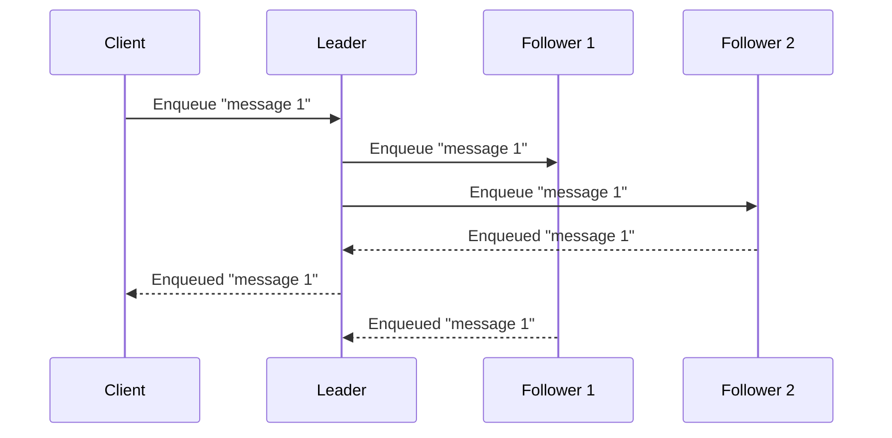
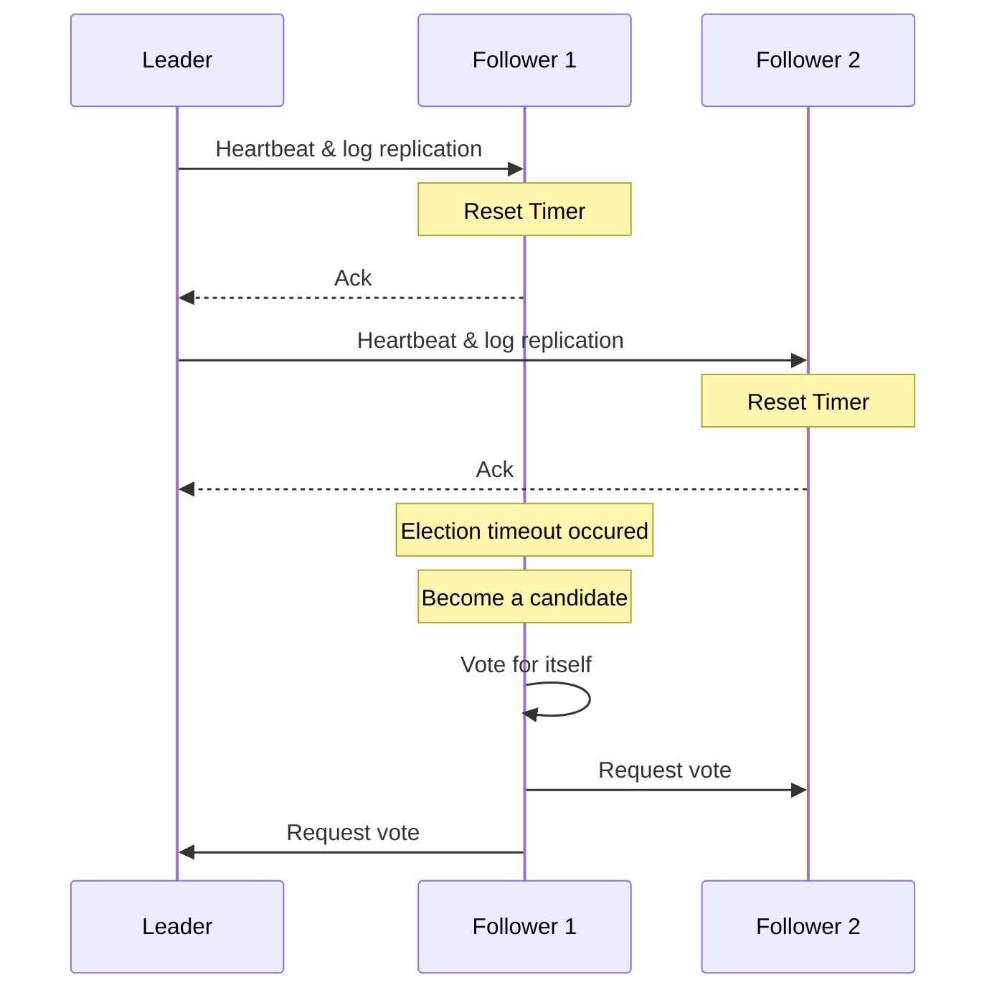

# Architecture

DOQ is a distributed, ordered message queue. Every state mutation is replicated
through the [Raft](https://raft.github.io/) consensus algorithm
([hashicorp/raft](https://github.com/hashicorp/raft)) and persisted to
[BadgerDB](https://dgraph.io/blog/post/badger/). Only the elected leader accepts
writes; a write is acknowledged to the client only after a majority of nodes
have durably stored it.

## Request flow

```
Client (HTTP or gRPC)
  → pkg/http/service.go   OR   pkg/grpc/server.go
  → pkg/raft/node.go      (Raft consensus — majority quorum required)
  → pkg/raft/fsm.go       (FSM applies committed log entries)
  → pkg/queue/manager.go  (manages named queues)
  → pkg/queue/queue.go    (in-memory queue + BadgerDB persistence)
```

Non-leader nodes transparently proxy write requests to the current leader via
`pkg/grpc/proxy.go`, so a client can connect to any node.

## Consensus

Raft manages a replicated log across the cluster. A value must be agreed on by a
majority of nodes before it is acknowledged to the client:



### Raft command pattern

Every state mutation is serialized as a `RaftCommand` protobuf (`pkg/proto/doq.proto`)
— a `oneof` over `createQueue`, `updateQueue`, `deleteQueue`, `enqueue`,
`dequeue`, `ack`, `nack`, `updatePriority`, `touch`, and `leaderConfigChange`.
The command is submitted to the Raft log, replicated, and then applied by the
FSM (`pkg/raft/fsm.go`), which is the single source of truth for queue state.

Read-only operations (get a message, list queues) bypass Raft and are served
directly from the leader.

## Storage

Persistence is handled through the `storage.Store` interface
(`pkg/storage/store.go`), implemented on top of BadgerDB. Each queue keeps an
in-memory structure for ordering (a heap or fair-scheduling tree) backed by
BadgerDB for durability. Raft snapshots are produced from the store so a
restarting or newly joined node can catch up quickly.

## Consistency

Achieving consistency in a distributed queue means ensuring operations on shared
state are coordinated so no two nodes independently mutate a queue. All enqueue,
dequeue, ack, and nack requests therefore flow through the leader, which
replicates them and only acknowledges once a majority has agreed. This prevents
race conditions and guarantees a single, consistent ordering of operations.

## Fault tolerance

To run a fault-tolerant cluster you need an **odd number of nodes, at least
three**. An odd count lets the cluster keep a clear majority (quorum) while
tolerating failures:

| Nodes | Quorum | Failures tolerated |
|-------|--------|--------------------|
| 3     | 2      | 1                  |
| 5     | 3      | 2                  |
| 7     | 4      | 3                  |

More nodes increase fault tolerance but also increase replication latency and
resource usage, so balance durability against performance.

### Failure detection & leader election

The leader periodically sends heartbeats to followers to assert leadership. If a
follower does not hear from the leader within its election timeout, it becomes a
candidate, votes for itself, and requests votes from the others to elect a new
leader:



For a deeper look at how Raft's stable store and log store are implemented on
BadgerDB, see [RAFT_STABLE_AND_LOG_STORES.md](../RAFT_STABLE_AND_LOG_STORES.md).

## Key packages

| Package | Purpose |
|---------|---------|
| `pkg/raft/` | Raft node (`node.go`) and FSM (`fsm.go`). The FSM is the single source of truth for queue state. |
| `pkg/queue/` | `Queue` wraps an in-memory queue plus BadgerDB; `QueueManager` manages all named queues. |
| `pkg/queue/memory/` | In-memory queue implementations: `delayed_queue.go` (heap), `fair_round_robin_queue.go`, `fair_weighted_queue.go`. |
| `pkg/http/` | REST API via Fiber v2 + Huma (OpenAPI). Admin UI served from an embedded `embed.FS`. |
| `pkg/grpc/` | gRPC service with bidirectional streaming for enqueue/dequeue, plus leader proxying. |
| `pkg/storage/` | `Store` interface + BadgerDB implementation; persistence and snapshots. |
| `pkg/proto/` | Protobuf definitions (`doq.proto`). All Raft-replicated commands are the `RaftCommand` oneof. |
| `pkg/cluster/` | Kubernetes SRV-based service discovery and leader-selector updates. |
| `pkg/config/` | Viper + Cobra configuration (flags, env vars, config file, defaults). |
| `pkg/metrics/` | Prometheus metrics per queue. |
| `pkg/entity/` | Shared data types: `QueueConfig`, `QueueSettings`, `Message`. |
