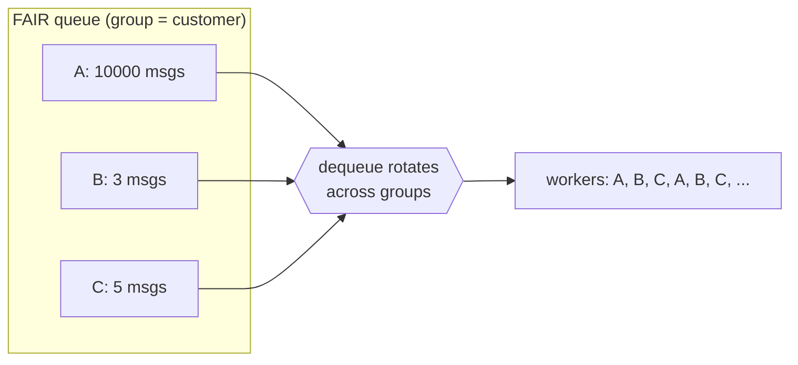
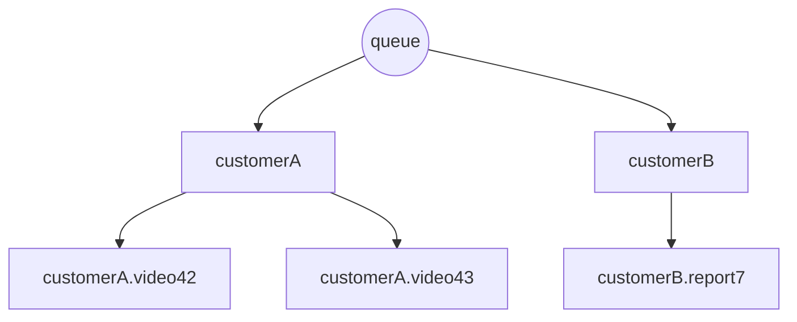

# Queues & Messages

DOQ is a **work queue** (task queue) with competing-consumer semantics: each
enqueued message is delivered to **exactly one** consumer, which then acknowledges
it. Running more consumers against a queue spreads the work across them — it does
**not** duplicate messages. DOQ is therefore a great fit for distributing
tasks/jobs to a pool of workers.

It is **not** a publish/subscribe system: there are no topics or subscriptions,
and a message is never fanned out to multiple consumers. If you need every
subscriber to receive a copy of every message, DOQ is not the right tool.

DOQ supports two queue types. Pick one per queue at creation time; it cannot be
changed afterwards.

| Type | Ordering | Use when |
|------|----------|----------|
| **DELAYED** | Strict priority (and optional time-delay) | You want a global priority order, or scheduled/delayed delivery. |
| **FAIR** | Round-robin or weighted across groups | You want to distribute work fairly across tenants/customers so one busy group can't starve the others. |

## DELAYED queues

A delayed queue is a priority queue backed by a binary min-heap. The message
with the **lowest `priority` number is delivered first**.

Because `priority` is just a number, you can use it as a **Unix timestamp** to
schedule delivery: a message whose priority is a future timestamp will not be
dequeued until that time has passed. This makes delayed queues suitable both for
priority scheduling and for "deliver this later" workflows.

**Good for:**

- **Priority job queues** — critical work (`priority: 1`) jumps ahead of bulk
  work (`priority: 100`).
- **Scheduled / deferred tasks** — "send this reminder in 1 hour" by setting
  `priority` to `now + 3600` as a Unix timestamp.
- **Retries with backoff** — on failure, re-enqueue with `priority` set to a
  future timestamp so the message isn't retried until the backoff elapses.

For example, three messages enqueued as:

```
priority=5    "resize avatar"        → dequeued 1st (lowest number)
priority=60   "generate thumbnail"   → dequeued 2nd
priority=<now+3600> "nightly report" → held until its timestamp passes
```

Delayed queues do not use the `strategy` setting, and `max_unacked` is not
applicable.

## FAIR queues

A fair queue delivers messages fairly across **groups** (the message `group`
field), so no single group can monopolise your workers.

### The problem it solves

Imagine a `transcode` queue with a limited pool of workers. Customer **A**
uploads 10,000 videos in a burst; customers **B** and **C** upload a handful.
With a plain FIFO/priority queue, A's 10,000 jobs sit at the front and B and C
wait for hours — one noisy tenant starves everyone else ("head-of-line
blocking").

A fair queue tags each message with its customer as the `group` and rotates
delivery **across groups** instead of draining one at a time:



Even though A has vastly more work queued, B and C keep making progress because
each dequeue moves on to the next group.

### Use cases

- **Multi-tenant task processing** — group by tenant/customer ID so one tenant's
  backlog can't delay others (transcoding, indexing, report generation).
- **Per-user rate fairness** — group by user so a power user submitting thousands
  of jobs shares the workers with everyone else.
- **Mixing large and small jobs** — a customer bulk-importing millions of rows
  doesn't block another customer's single urgent job.

### Strategies

Fair queues take a `strategy` setting that controls *how* the next group is
chosen. Within a group, messages are always ordered by `priority`.

**`round_robin`** — visits groups in a fixed rotation, taking the
highest-priority message from each in turn. Every non-empty group is served
equally often, regardless of how much it has queued:

```
groups:  A=[a1 a2 a3 …]   B=[b1 b2]   C=[c1 c2 c3]
dequeue order: a1  b1  c1  a2  b2  c2  a3  (A)  c3  (A) …
                └───────── one full rotation ─────────┘
```

**`weighted`** — samples the next group at random, weighted by how much
**unacked headroom** it has. A group's weight is roughly
`10 × (1 − unacked / (max_unacked + 1))`, and drops to `0` when the group is
empty or has hit its `max_unacked` limit. In effect, groups that currently have
the fewest in-flight (dequeued-but-unacked) messages are favoured, which spreads
in-flight work evenly across active groups while still guaranteeing every group
makes progress. (Weight depends on in-flight load, **not** on how many messages
a group has waiting.)

| | `round_robin` | `weighted` |
|---|---|---|
| Selection | Deterministic rotation | Randomised, weighted sampling |
| Favours | Every group equally | Groups with the most free in-flight capacity |
| Best when | You want strict, predictable turn-taking | Consumers are slow/uneven and you want to balance in-flight work |

### Hierarchical groups

The `group` field is split on `.`, so a group like `customerA.video42` builds a
**two-level tree** and fairness is applied at *each* level: DOQ first picks
fairly among customers, then fairly among that customer's jobs. This lets you be
fair across tenants **and** across each tenant's individual jobs at once.



With groups `customerA.video42`, `customerA.video43`, and `customerB.report7`,
customer B gets the same overall share as customer A even though A has two active
jobs — and A's two jobs share A's slice fairly between themselves. Groups can
nest arbitrarily deep (`region.tenant.job`, …).

### `max_unacked`

Fair queues honour a per-group `max_unacked` limit — the number of messages that
may be dequeued-but-not-yet-acknowledged for a single group at once. When a group
reaches its limit, it is skipped during dequeue until some of its in-flight
messages are acked (or time out and are redelivered). This bounds how much work
a single group can hold in flight, and (for the `weighted` strategy) is what the
weighting is calculated against.

### Worked example

Create a round-robin fair queue and enqueue work for three customers:

```bash
curl -X POST http://localhost:8000/API/v1/queues \
  -H 'Content-Type: application/json' \
  -d '{"name": "transcode", "type": "fair", "settings": {"strategy": "round_robin", "max_unacked": 50}}'

# Customer A floods the queue…
for i in $(seq 1 1000); do
  curl -s -X POST http://localhost:8000/API/v1/queues/transcode/messages \
    -H 'Content-Type: application/json' \
    -d '{"group": "customerA", "priority": 10, "content": "videoA-'"$i"'"}' >/dev/null
done

# …while B and C enqueue a little
curl -X POST http://localhost:8000/API/v1/queues/transcode/messages \
  -H 'Content-Type: application/json' \
  -d '{"group": "customerB", "priority": 10, "content": "videoB-1"}'
curl -X POST http://localhost:8000/API/v1/queues/transcode/messages \
  -H 'Content-Type: application/json' \
  -d '{"group": "customerC", "priority": 10, "content": "videoC-1"}'
```

Dequeuing repeatedly yields `customerA`, `customerB`, `customerC`, `customerA`,
… — B and C are served on the very next dequeues instead of waiting behind A's
1,000 messages.

## Message fields

| Field | Required | Description |
|-------|----------|-------------|
| `id` | no | Unique message ID. Auto-generated (Snowflake) if omitted. |
| `group` | no (default `default`) | Group used by fair queues for fairness; ignored by delayed queues. |
| `priority` | yes | Ordering value. Lower is delivered first; can be a future Unix timestamp in delayed queues. |
| `content` | yes | The message payload (typically a JSON string). |
| `metadata` | no | Arbitrary `string → string` map, e.g. a retry counter or trace ID. |

## Delivery lifecycle

The `ack` flag on dequeue selects the delivery semantics:

- **`ack=true` → at-most-once.** The message is removed the moment it's handed
  out. If your consumer crashes before finishing, the message is gone — there is
  no redelivery. Fastest, but lossy on failure.
- **`ack=false` → at-least-once.** The message becomes *in-flight* and is only
  removed when you explicitly acknowledge it. If you never do, it is
  redelivered (see *Automatic redelivery* below). Safe against consumer
  failures, at the cost of possible duplicate delivery, so consumers should be
  idempotent.

Step by step:

1. **Enqueue** a message onto a queue.
2. **Dequeue** returns the next message, with `ack=true` or `ack=false` as above.
3. **Acknowledge** an in-flight message (only needed when dequeued with
   `ack=false`) once processing succeeds:
   - **ack** — remove it permanently.
   - **nack** — return it to the queue for redelivery. You may set a new
     `priority` and `metadata` when nacking.
   - **touch** — extend the acknowledgement deadline for a long-running job so it
     isn't redelivered while you're still working on it.
4. **Automatic redelivery** — if an in-flight message is not acked within its
   acknowledgement timeout, it is returned to the queue. Unacked messages are
   checked every `queue.acknowledgement_check_interval` seconds; the timeout
   defaults to `queue.default_acknowledgement_timeout` (see
   [configuration.md](configuration.md)) and can be overridden per queue with the
   `ack_timeout` setting.

You can also change a message's `priority` while it is waiting in the queue with
the update-priority operation.

## Queue settings

Passed under `settings` when creating or updating a queue:

| Setting | Applies to | Description |
|---------|------------|-------------|
| `strategy` | FAIR | `round_robin` or `weighted`. |
| `max_unacked` | FAIR | Max in-flight (dequeued but unacked) messages per group. |
| `ack_timeout` | both | Seconds before an unacked message is redelivered (overrides the server default). |

## Examples

Create a delayed queue named `user_indexing_queue`:

```bash
curl --request POST \
  --url http://localhost:8000/API/v1/queues \
  --header 'Content-Type: application/json' \
  --data '{"name": "user_indexing_queue", "type": "delayed"}'
```

Create a weighted fair queue:

```bash
curl --request POST \
  --url http://localhost:8000/API/v1/queues \
  --header 'Content-Type: application/json' \
  --data '{"name": "transcode", "type": "fair", "settings": {"strategy": "weighted", "max_unacked": 100}}'
```

Delete a queue:

```bash
curl --request DELETE \
  --url http://localhost:8000/API/v1/queues/user_indexing_queue
```

See [api.md](api.md) for the full set of message operations.
